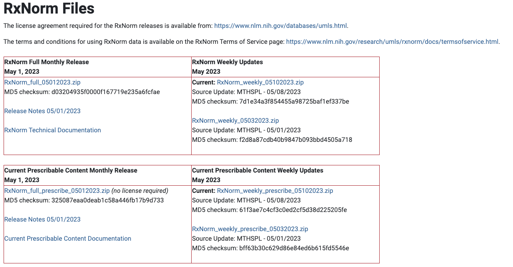
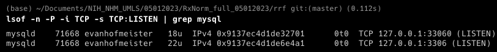
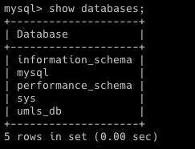
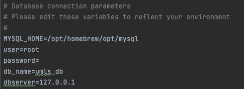
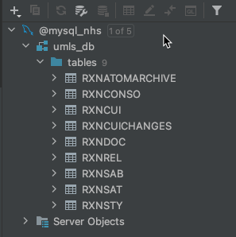
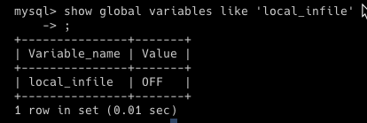
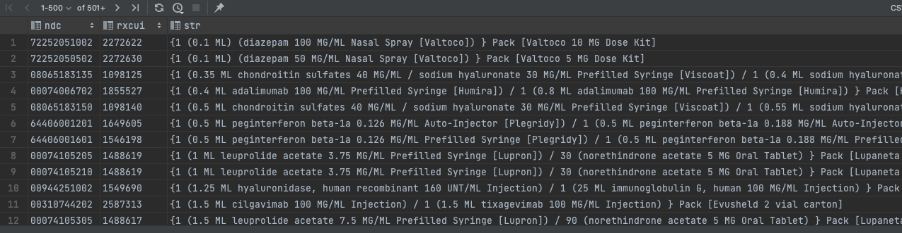

## Instructions to Set-Up NIH UMLS RxNorm Database

The Unified Medical Language System (UMLS) integrates and distributes key terminology, classification and coding standards, and associated resources to promote creation of more effective and interoperable biomedical information systems and services, including electronic health records.

UMLS is a [set of files and software](https://www.nlm.nih.gov/research/umls/sourcereleasedocs/index.html) that brings together many health and biomedical vocabularies and standards to enable interoperability between computer systems.

---
### Instructions to set up database 
To set up a local database, first begin by signing-up for a 'UMLS Terminology Services Account' so you can download files:
* [UMLS Sign-Up](https://uts.nlm.nih.gov/uts/signup-login)

Next download the latest RxNorm files:
* [RxNorm Files](https://www.nlm.nih.gov/research/umls/rxnorm/docs/rxnormfiles.html)




For this tutorial I used the [latest available monthly release](https://download.nlm.nih.gov/umls/kss/rxnorm/RxNorm_full_05012023.zip)

Assuming you are using open-source MySQL and running on a Unix based system like MacOS, navigate to:

`~/RxNorm_full_mmddyyyy/scripts/mysql`

You should see the below files:

| # | File_Name                       | Description                                                       |
|---|---------------------------------|-------------------------------------------------------------------|
| 1 | populate_mysql_rxn.sh           | Loads RxNorm subsets into a MySQL database (i.e., runs sql files) |
| 2 | Table_scripts_mysql_rxn.sql     | Creates and loads tables                                          |
| 3 | Load_scripts_mysql_rxn_unix.sql | Loads data from .rrf files                                        |
| 4 | Indexes_mysql_rxn.sql           | Adds indexes to database tables                                   |

To avoid having to set a path to the data, simply copy these four files to the directory that contains the `.rrf` data files:

`
~/RxNorm_full_05012023/rrf
`

---
### CREATE DATABASE
first we need to create a MySql database to store the data. To do this, open terminal and run the below bash commands 

Check which ip address and port mysql is running on:
``` bash
lsof -n -P -i TCP -s TCP:LISTEN | grep mysql
```



Next, login to the MySql command line client:
``` bash
MySQL -h <IP ADDRESS> -u root
```

Create a new database for the RxNorm files:
``` bash
mysql -u root CREATE DATABASE <YOUR DATABASE NAME>
```

You should now see the database you created, in my case it's labeled `umls_db`:
``` bash
mysql> show databases;
```



---
### RUN POPULATE SCRIPT 
Next we'll run the `.sql` files which create schemas and tables and then load data from the `.rrf` files

Change the current working directory to the location of the scripts:
``` bash
cd ~/RxNorm_full_05012023/rrf
```

Next fill in the below parameters in the `populate_mysql_rxn.sh` file:
``` bash
MYSQL_HOME=<MYSQL DIRECTORY>
user=<MYSQL DATABASE USERNAME>
password=<MYSQL DATABASE PASSWORD>
db_name=<MYSQL DATABASE NAME>
dbserver=<MYSQL DATABASE SERVER>
```

In my case, since I have installed MySql with brew, have a username of `root`, and a do not have a password on the database:



Next, execute the bash file and enter a password if prompted:
``` bash
sh populate_mysql_rxn.sh
```

Note, this command will create a log file `mysql.log` that details whether each step has successfully run or failed with additional detail on any errors that have occurred:

Below are the tables that were generated with these scripts:



If you run into a permission error, run the below code. The chmod 775 command will grant the read, write, and execute permissions:
``` bash
chmod 775 populate_mysql_rxn.sh
```

If you receive the below error in the `mysql.log`:

`error:"ERROR 3948 (42000) at line 1: Loading local data is disabled; this must be enabled on both the client and server sides"`


You should check whether the local_infile is disabled or enable. 

To do this first log into the MySql client:
``` bash
MySQL -h <IP ADDRESS MySql is running on> -u root
```

Then run the below command to see the info on the `local_infile` variable:
``` bash
mysql> show global variables like 'local_infile';
```



If it says 'No' then run the below command to enable `local_infile`:
``` bash
mysql> set global local_infile=true;
```

## Additional instructions provided by NIH NLM below:
* [UMLS Homepage](https://www.nlm.nih.gov/research/umls/index.html)

* [Video tutorial for Querying RxNorm Tables](https://www.nlm.nih.gov/research/umls/user_education/quick_tours/RxNorm/ndc_rxcui/NDC_RXCUI_DrugName.html)

* [RxNorm technical documentation](https://www.nlm.nih.gov/research/umls/rxnorm/docs/techdoc.html#s13_0)


## Mapping NDC, RXCUI, and Drug Names in the RxNorm Files

Now that the database has been successfully created and populated with data, queries can be run to retrieve data.

Here is a SQL query example to obtain a map of NDC-RXCUI-Drug Name information joined on RXAUIs in
a relational database.

``` sql
SELECT rs.atv as ndc, rs.rxcui, rc.str
FROM rxnsat rs, rxnconso rc
WHERE rs.atn = 'NDC'
AND rs.rxaui = rc.rxaui
AND rc.sab = 'RXNORM'
AND rc.tty in ('SCD','SBD','GPCK','BPCK')
ORDER BY rc.str;
```

Here are the results. The first column has NDCs, the second has the RXCUIs, and finally the drug names
are in the String column.

